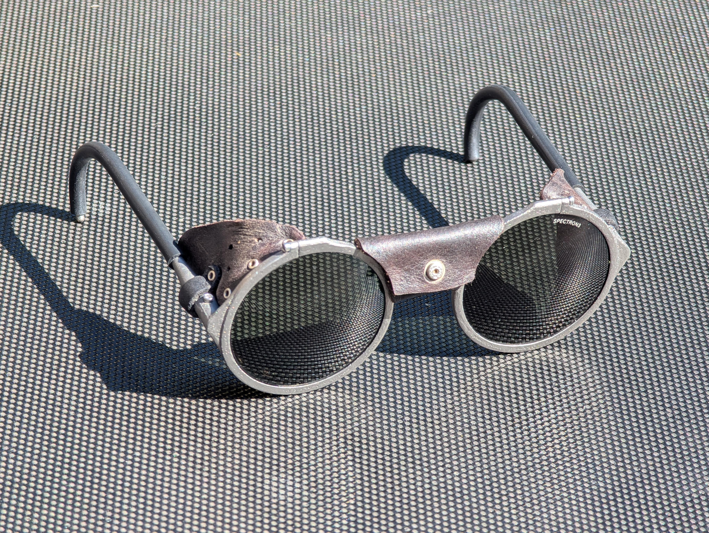
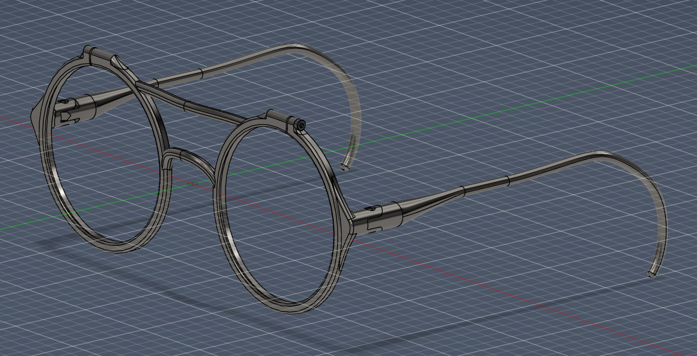
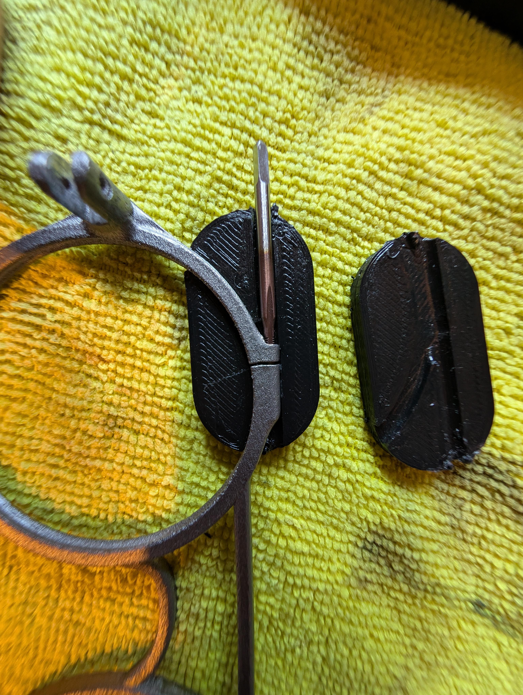
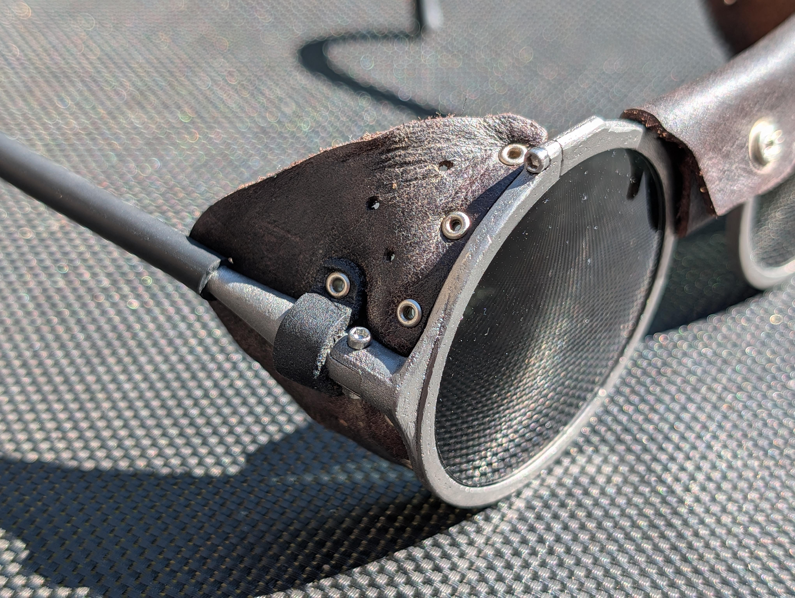

## Project Overview
This project started the way a lot of my builds do: with something breaking that I did not feel like paying to replace. I own a pair of Julbo Vermont Classic alpine sunglasses, the classic round glacier glasses with leather side shields. On a recent trip one of the temple legs snapped clean off. That stung a little, because I do not wear these often and I was nowhere near having gotten my money's worth out of them.

The frustrating part was that everything except the broken temple was still perfectly fine. The lenses, the side shields, the hardware, all in good shape. Rather than fix a single leg and wait for the other one to fail next, I decided to design an entirely new frame and 3D print it in titanium, then transplant the original lenses and shields onto it. The result is a sturdier pair of glasses for less than the cost of a replacement.

## Background
The Vermont Classic is a good pair of glasses, but the original frame is fairly intricate. Repairing just the broken temple would have meant matching that geometry and hinge detail, and even then the second, un-broken leg was the obvious next weak point. Fixing one side just to have the other break later did not appeal to me.

Since the lenses and side shields were undamaged and are the parts that actually matter optically, they became the fixed starting point for the design. Everything else, the frame, the bridge, the temples, was up for a full redesign around them.

## Design & Build
I modeled a new frame from scratch, built specifically around the dimensions of the existing round lenses and the mounting points for the leather side shields. Designing it fresh instead of copying the original let me make the frame simpler and more robust, with thicker sections where the old frame was delicate, especially around the temple hinges where the original failed.

:::note[Why titanium?]
Titanium gives an excellent strength-to-weight ratio and is highly corrosion resistant, which suits eyewear that gets exposed to sweat, sunscreen, and alpine conditions. It lets the frame stay light on the face while being far tougher than the part it replaced.
:::

Once printed, the frame needed post-processing to become a working pair of glasses. The mounting holes were tapped so the lenses and side shields could be fastened with screws, and I used a simple jig to hold the frame square while cutting the threads.

With the threads cut, the original lenses and leather side shields transferred straight over onto the new frame.

## Challenges
The main constraint was that the new frame had to match the original lenses and shields exactly, since those were being reused rather than remade. The lens seats and the shield mounting points had to line up precisely or nothing would fit. Tapping clean threads into the printed titanium and keeping the frame aligned while doing it was the other fiddly part, which is where the jig earned its place.

## Results
The rebuilt glasses are sturdier than the originals, particularly around the temples that were the original point of failure. The optics are unchanged because the lenses and side shields are the same ones I started with, and the whole repair came in cheaper than buying a replacement pair.

## Conclusion
What started as an annoying breakage turned into a better pair of glasses than I had before. Reusing the still-good lenses and shields on a purpose-built titanium frame meant I kept everything that worked, fixed the part that did not, and ended up with something tougher and cheaper than a store-bought replacement.
