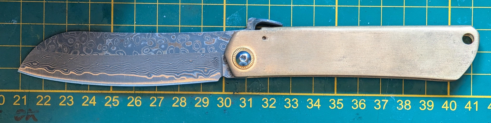
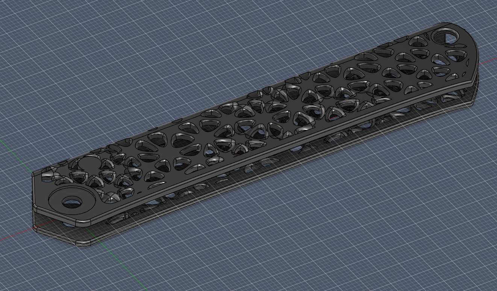
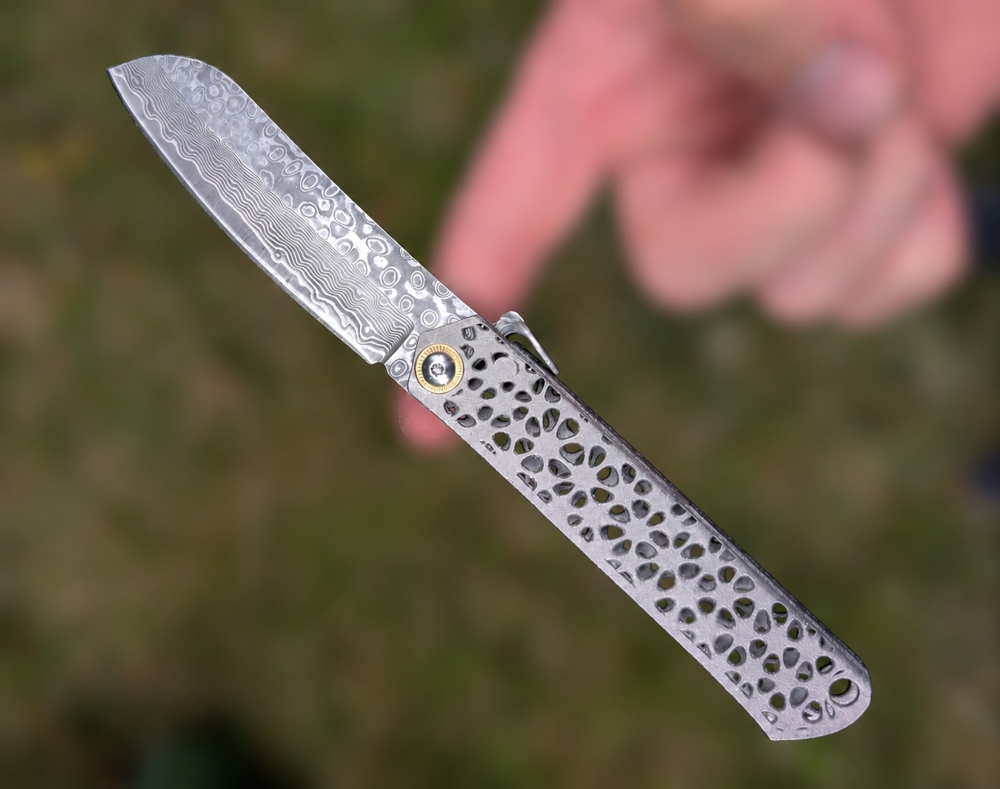

## Project Overview
This project started with a problem, not a design brief. My knife is a Japanese-style Higonokami, a traditional friction folder, and mine shipped with a solid brass handle. Brass looks great on day one, but it reacts badly to skin: sweat and body oils tarnish the surface quickly, and after a day of handling it develops a distinct metallic, sour smell. That is a minor annoyance at a desk, but a real one at a campsite, where the same knife is used to prepare and eat food. A handle that smells of oxidized brass is not something you want anywhere near a meal.

The goal was to replace the brass scale with a custom, 3D printed titanium handle: corrosion resistant, odor-free, lighter, and ergonomically optimized.

## Why Titanium
Ti-6Al-4V solves the exact failure mode of the brass handle:

:::note[What is Ti-6Al-4V?]
Ti-6Al-4V (grade 5 titanium, also sold under the Chinese designation TC4) is an alloy of titanium with 6% aluminium and 4% vanadium. It is the workhorse of aerospace and medical titanium parts thanks to its excellent strength-to-weight ratio and corrosion resistance.
:::

- **Corrosion resistance:** Titanium forms a stable, inert oxide layer. It does not react with sweat the way brass does, so there is no tarnish and no metallic smell to transfer onto food.
- **Strength-to-weight:** A high strength-to-weight ratio let me hollow the handle aggressively while keeping it stiff. Every gram counts when I am carrying this knife camping, so the lighter handle directly reduces the weight I have to pack.
- **Finish:** The as-printed and bead-blasted titanium surface gives a clean, matte aesthetic that pairs well with the damascus blade.

## Design Considerations
Originally I set out to make a straight 1:1 copy of the brass scale in titanium. That changed once I started modeling. Instead of a solid replica, I created a mesh in Fusion 360 and used the form and pipe tools to turn that mesh into a strut-like structure. The result is an open, organic-looking lattice rather than a solid billet: lighter, and far more interesting to look at.

:::tip[From solid copy to lattice]
Abandoning the 1:1 copy was the turning point of the design. Building the handle as a strut network instead of a solid scale removed most of the internal mass while keeping the stiffness exactly where it is needed, around the pivot and pocket-clip bosses.
:::

- **Ergonomics:** The handle profile was matched to the original folder's pivot and stop-pin geometry so the blade action and pocket clip mounting carried over unchanged, while the grip cross-section was reshaped for a more secure hold.
- **Weight Optimization:** The lattice removes the majority of the internal mass. Instead of a solid scale, the load is carried by a network of struts, dropping weight substantially without sacrificing rigidity where it matters, around the pivot and pocket-clip bosses.
- **Surface Finish:** The final part was bead blasted for an even matte texture that hides layer lines and resists fingerprints.

## Technical Challenges
The hardest part was building the lattice structure without any purpose-made tooling for it. Fusion 360 has no dedicated lattice or Voronoi generator, so I had to improvise the whole thing from a hand-built mesh, then piping that mesh into solid struts. Getting the strut density, thickness, and node transitions to look organic while staying printable and structurally sound took a lot of trial and error.

There was also the usual titanium concern of thermal stress during the build. The thin struts have little mass to resist warping as the part cools, but the modeling problem was by far the bigger obstacle.

:::warning[Thermal stress on thin struts]
With so little mass in each strut, the lattice cools unevenly and is prone to warping and residual stress during a metal print. Strut thickness and node transitions had to stay within printable limits to keep the part from distorting.
:::

## Result
The finished titanium handle solves the original problem completely: no tarnish, no smell, and a knife that is now genuinely pleasant to use at the table and in the field. As a bonus, it is lighter and better balanced than the brass original.

## Conclusion
What began as a fix for a smelly brass handle turned into a testbed for printing thin-walled, lattice-based titanium parts. The same approach, corrosion-proof material plus aggressive internal weight reduction, opens up possibilities for other tools and hardware where both durability and low mass matter.
