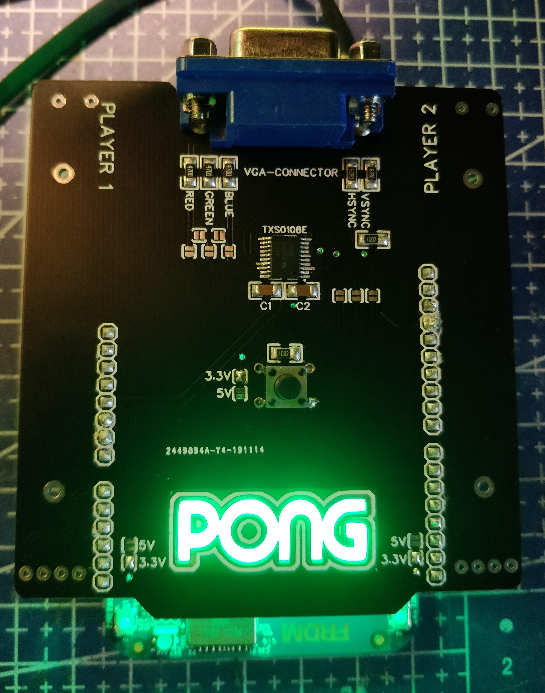

## Project Overview

The goal of this project was to drive a display over VGA straight from a microcontroller and use it to play the classic game of Pong. The game is controlled with two potentiometers, one per player, and started with a push button.

The firmware was written in C for the mbed FRDM-K64F board and structured around a clean three-tier architecture, keeping the low-level hardware drivers, the value-conversion middleware, and the game logic cleanly separated.

Tools and hardware used:

- Mbed FRDM-K64F development board
- A screen with a VGA connection
- A custom shield carrying the two potentiometers, the VGA connector, and a level shifter to drive the VGA
- MCUXpresso IDE

## Background

Pong contains two paddles, each controlled by a player. The players use their paddles to bounce the ball back toward the opponent. If the ball gets past a player's paddle, the other player scores a point. In short, it is the digital version of table tennis.

Generating a VGA signal directly from a microcontroller, without a dedicated graphics chip, means the firmware has to produce the horizontal and vertical sync timing itself while also outputting the colour signals. That timing requirement is what makes driving VGA from bare metal an interesting challenge.

## Design & Build

### Driving VGA

To drive a screen over VGA, five signals are needed: two sync signals for the horizontal and vertical synchronisation, and three colour signals for red, green, and blue that determine what is drawn on screen.

### Three-tier architecture

The software was split into three layers:

:::note[Why three tiers?]
Separating the code into a driver layer, a middleware layer, and a top layer keeps the hardware-specific details isolated from the game logic. Each layer can be developed and tested on its own, and swapping out hardware only affects the drivers.
:::

**1. Driver layer**

- *VGA driver*: responsible for drawing the game onto the screen by driving the colour and sync pins described above.
- *Button driver*: reads the button that resets and then starts the game. It includes a debouncer that uses a short delay before reading the value, to suppress the mechanical bounce when the button is pressed or released.
- *Potentiometer driver*: reads the two potentiometers, one for each player, and provides their raw values.

**2. Middleware**

The middleware converts the raw values coming from the drivers (and from the top layer) into values that are usable by the other layers. The potentiometer readings are translated into paddle positions and passed up to the top layer, and the button state is forwarded so the top layer knows when to reset and start. In the other direction, the paddle and ball positions computed by the top layer, along with the correct colours, are passed down to the VGA driver.

**3. Top layer**

The top layer contains the full Pong game. It is driven by two states: a **reset** state and a **start** state. When the button is pressed, the game first resets and then starts.

- In the *reset* state, everything is prepared for the players before play begins: the ball is placed back in the centre of the field, the scores are set to zero, and the paddles are re-synchronised with the current potentiometer positions.
- In the *start* state, the ball is launched in a random direction and the players use their paddles to defend their side of the field.

### The shield

Since the mbed FRDM-K64F board has no VGA connector of its own, a custom shield was built to fit on top of the board. The shield carries the two potentiometers used to play Pong, the VGA connector, and a level shifter that translates the microcontroller's logic levels to the voltages needed to drive the VGA output.

As a finishing touch, the shield features a backlit Pong logo: LEDs shine through the exposed glass-fibre core of the PCB, where the copper and solder mask were removed, so the translucent substrate lights up and reveals the logo.

:::tip[Design detail]
Removing the copper and solder mask over the logo leaves only the bare glass-fibre substrate, which is translucent enough for LEDs mounted behind it to shine through. It is a cheap trick that turns the PCB itself into a light guide.
:::

## Challenges

By far the biggest challenge was the VGA output itself. The standard 640 × 480 @ 60 Hz mode is driven from a master **pixel clock of 25.175 MHz**, which means a new pixel has to be presented roughly every 40 ns.

The FRDM-K64F runs from a **50 MHz external oscillator**, which the internal PLL multiplies up to a **120 MHz** core clock. Even at that speed, comparing it to the VGA pixel clock shows just how tight the timing budget is:

$$
\frac{120\ \text{MHz}}{25.175\ \text{MHz}} \approx 4.77\ \text{clock cycles per pixel}
$$

:::important
Fewer than five clock cycles per pixel is the crux of the whole project. A single pixel already needs a colour fetch, a port write, and the loop overhead, so there is no room to touch all 640 horizontal pixels one by one.
:::

Fewer than five cycles per pixel is nowhere near enough. Outputting a single pixel means fetching its colour and writing it to the output port, on top of the loop overhead of the scan-out routine, comfortably more work than a handful of instructions can do. There simply aren't enough CPU cycles to drive each of the 640 horizontal pixels individually.

The analog colour signals add a second ceiling: they are produced through the DAC, whose clock typically runs at around **60 MHz**, which caps how quickly the analog output can actually be updated. Between the CPU cycle budget and the analog output rate, driving every pixel individually was never going to work.

The solution was to **bin pixels**: instead of one value per screen pixel, several adjacent pixels are driven with the same colour. This lowers the effective pixel rate to something the core can keep up with, at the cost of horizontal resolution, a deliberate trade-off that made a stable, glitch-free image possible.

:::tip[Pixel binning]
By driving a group of neighbouring pixels with one colour value, the effective pixel clock drops by that same factor. Trading horizontal resolution for timing headroom is what makes a rock-steady image possible on a plain microcontroller.
:::

Because the CPU is fully occupied streaming out the picture, there is no time left to compute the game state while a frame is being sent. All of the actual drawing (moving the ball, updating the paddles, redrawing the score) had to be squeezed into the **dead times between frame transfers** (the blanking intervals), when no pixels are being pushed to the screen. To keep everything locked to the VGA timing, the horizontal and vertical sync are generated with **timer interrupts**, which fire at exactly the right moments and drive the whole scan-out and update cycle. On top of the timing work, the button needed a debouncer to avoid false triggers, and the potentiometer readings had to be mapped cleanly into paddle positions so the controls felt responsive.

## Results

The result is a working Pong game rendered over VGA and driven entirely from the FRDM-K64F, with two players controlling their paddles via potentiometers and starting each round with a button press.

This was a collaborative project with [Donovan Baillieu](https://github.com/DonovanBaillieu). The full source code and documentation are available on GitHub:

::github{repo="MichelDequick/mbed-vga-pong"}

## Conclusion

The project demonstrates that a bare-metal microcontroller can generate a VGA signal and run an interactive game without any dedicated graphics hardware. The three-tier architecture kept the hardware drivers, value conversion, and game logic cleanly separated, which made the system easier to reason about and extend.
